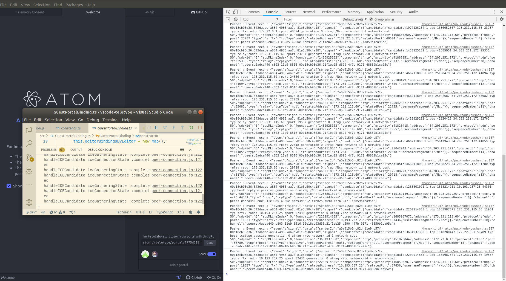
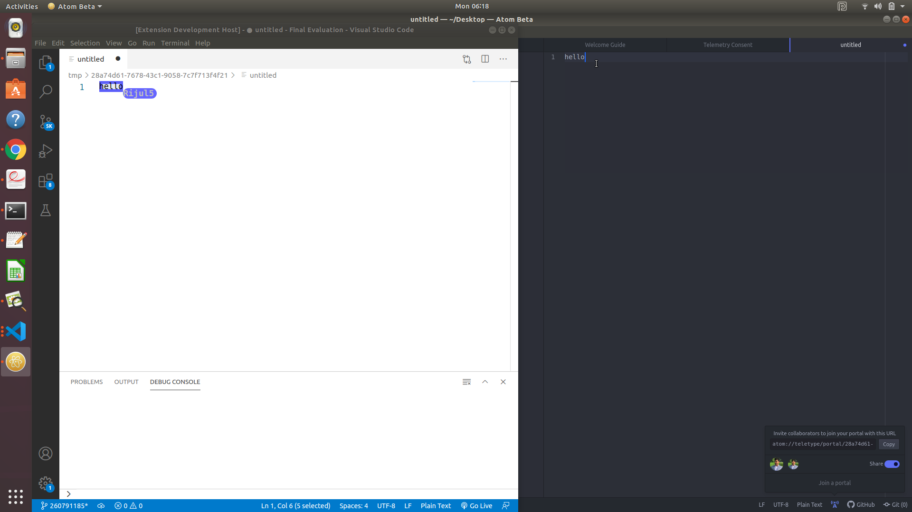
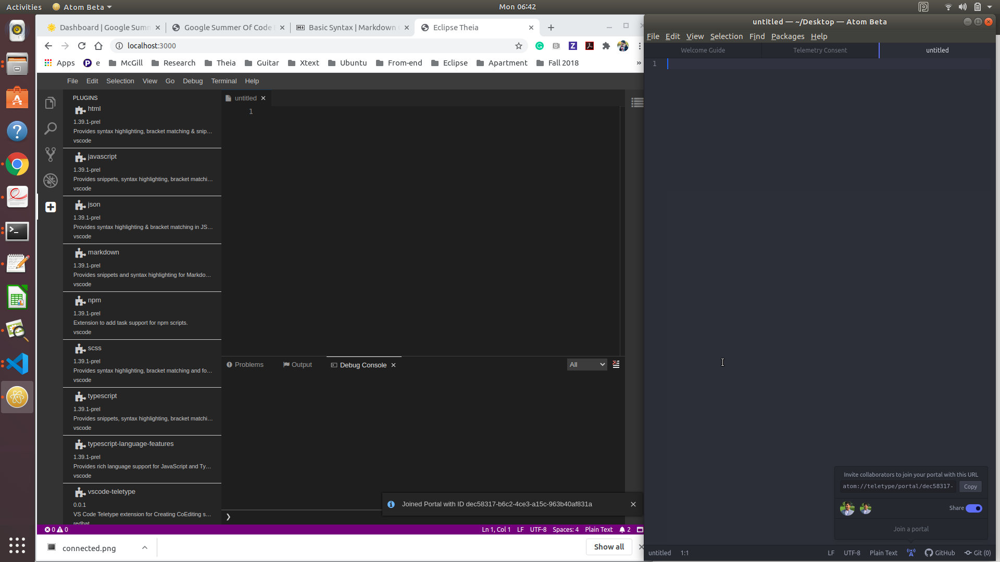
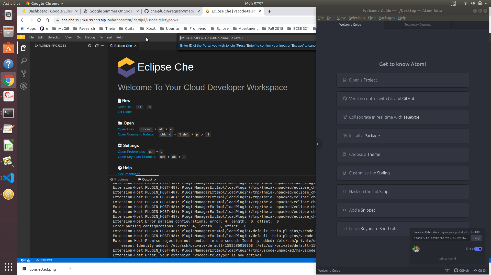
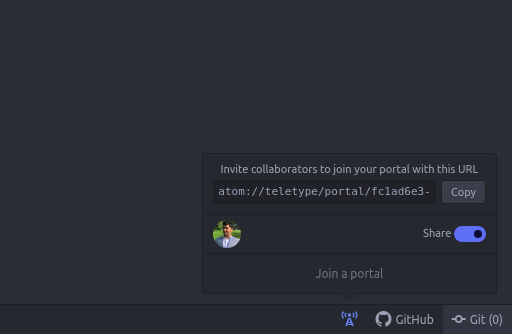
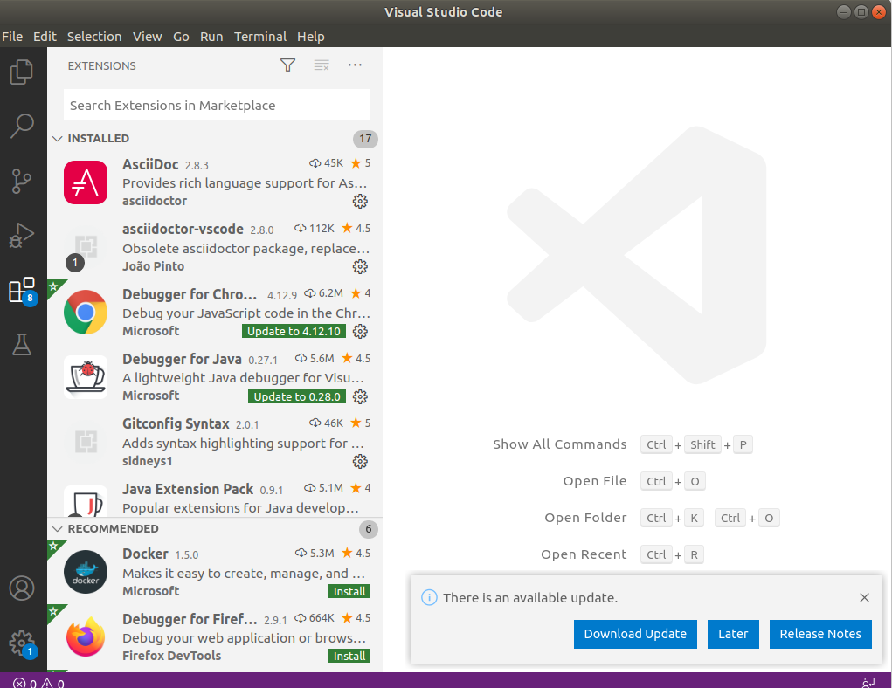
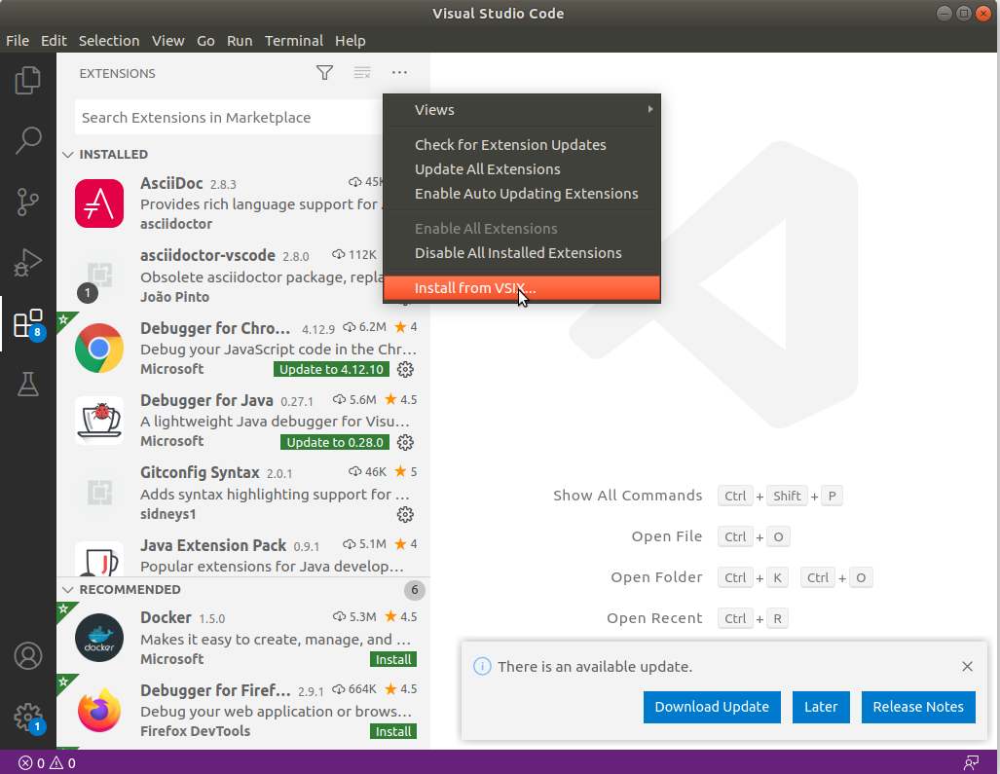

# Google Summer of Code'20
This site aims to explain the work done under the Google Summer of Code (GSoC) - 2020 for the [Eclipse Che](https://www.eclipse.org/che/) open source project. The project aims to bring CoEditing support in the new architecture of Che. 


The remainder of this site is structured as follows. Section [I](intro) introduces the project and motivates our problem statement which we plan to address under this project. Section [II](background) discusses the technologies used in this project and the previous work done in the direction. Section [III](miles) describes the work done under the GSoC'20 edition and the milestones achieved. Section [IV](results) presents our project design and the results. Finally, Finally, in Section [V](conclusions), technical challenges and the broader implications of our project for the Che community and for collaborative tool building communities are discussed.

## Introduction<a name="intro"></a>
Today, distributed software development teams depend on online collaboration more than ever. The ongoing pandemic Covid-19 has enforced self-quarantine for millions of people around the world. 

>The opportunity and requirements for telework and online collaboration arise rapidly. This collaboration can be used for various purposes such as mentoring sessions, code reviews, and co-editing. 

In Eclipse Che 6 and GWT editor, Teletype libraries were integrated to bring live collaboration capabilities. However, Che 7 and Theia IDE lack those capabilities. Therefore, CoEditing support is required in the new architecture of Che so that users can collaborate efficiently on their projects.

## Background and Previous Work<a name="background"></a>
In the last couple of years, different prototypes have been built to demonstrate pair programming in Eclipse Che. The first prototype was developed with Eclipse Flux. The use of ot.js (Operational Transform) and [Atom's Teletype](https://github.com/atom/teletype) have also been proposed for a browser-friendly approach and to solve conflict issues. Furthermore, in Che 6 and GWT editor, Teletype libraries were integrated to establish live collaboration capabilities. The next generation Che (version 7) is based on the extensible plugin model and has Theia as its default IDE.

In our [previous work](https://rijul5.github.io/GoogleSummerOfCode-Che-2019/), we developed a VS Code extension using [atom-teletype client](https://github.com/atom/teletype-client) and [node-webrtc](https://www.npmjs.com/package/webrtc) libraries in [Typescript](https://www.typescriptlang.org/) language. This extension enables users to join the portal launched from an Atom editor. In our previous work, we could only see the users joining the portal in debugging mode, i.e., when we launch the atom editor in development mode and read the logs generated in the development console. It was also possible to see the user GitHub profile photo once the user joins the portal.



>The above preliminary results indicated that it is possible to build a VS code extension using [atom-teletype client](https://github.com/atom/teletype-client) and [node-webrtc](https://www.npmjs.com/package/webrtc) libraries. 

Therefore, more work and research is required for this extension to develop the remaining features. For example, a document opened by a user on one system could be open automatically on the other system and both users can co-edit the document collaboratively in real-time. These features are essential to bring the collaboration capabilities in Che 7.


## Current Work and Milestones<a name="miles"></a>
In the previous edition ([GSoC'19](https://rijul5.github.io/GoogleSummerOfCode-Che-2019/)) demonstrated that our VS Code extension enables users to join a portal launched from the Atom editor and that a VS Code extension (we used a simple Hello world VS Code extension for testing) can be deployed in Che. In the current edition (GSoC'20), we extended this project along 3 directions which we also treat as our milestones - (a) Further Development of certain CoEditing features (b) Testing the VS Code extension locally, and (c) 
Deployment and testing of VS Code extension as Che plugin in Che workspace. We further explain the technical details now towards these three milestones.

### (a) Further Development of some CoEditing Features
We developed the GuestPortal, Editor, and Buffer bindings. These bindings enable multiple users to join the same portal. To explain this, we consider user-1, user-2, and user-3. The user-1 launches a portal using the Atom editor and shares the portal-id with the user-2 and user-3 by using any communication medium, e.g., slack or mattermost. Next, both user-2 and user-3 can use our VS Code extension on their respective machines to join this portal. In addition, if a document is opened by any user, then the other users immediately see the same document (with the same name) on their applications too. Furthermore, the user can see the GitHub profile photo and the cursors of other users on the document which is being co-edited. The below screenshot demonstrates the above features.

 <br><br>

### (b) Testing the VS Code extension locally
To test our VS Code extension locally, we focussed on two aspects. First, the VS Code extension should work when we are using it in debug mode or when we installing the VS Code extension using <strong><em>vsix</em></strong> file. Second, the VS Code extension needs to be tested with plain Theia IDE (Eclipse Theia) when running locally. Che Theia and Eclipse Theia have almost the same architecture. The above screenshot demonstrates the features while running the VS Code extension locally in debug mode. A document opened by one user is immediately opened on the application/machine of the other users who have joined the same portal. The users can co-edit the same document. In addition, the user can also see the cursors of the peer-users who are co-editing the same document as shown in the above screenshot. The results are similar when we test our VS Code extension using <strong><em>vsix</em></strong> file and when we deploy our VS Code extension as a plugin in plain Theia (running locally). The below screenshot presents the co-editing functionality of our VS Code extension in plain Theia. In the bottom left, our VS Code extension is represented by <strong><em>vscode-teletype</em></strong> plugin.

 <br><br>

### (b) Deployment and testing of VS Code extension as Che plugin in Che workspace
To deploy our VS Code extension as a plugin in a Che Workspace, we created a [meta.yaml](https://github.com/Rijul5/che-plugin-registry/blob/master/v3/plugins/ms-vscode/vscode-teletype/0.1.1/meta.yaml) file in a forked repository of che-plugin-registry. The configuration is also provided below. This meta.yaml file provides the link to the <strong><em>vsix</em></strong> file of our VS Code extension.

```markdown
apiVersion: v2
publisher: ms-vscode
name: vscode-teletype
version: 0.1.0
type: VS Code extension
displayName: vscode-teletype
title: Co-editing support
description: VS Code Teletype extension for Creating CoEditing skeleton for Eclipse Che and Theia
icon: https://www.eclipse.org/che/images/logo-eclipseche.svg
repository: https://github.com/Rijul5/vscode-teletype-guest
category: Other
firstPublicationDate: '2019-09-19'
spec:
  extensions:
    - https://github.com/che-incubator/vscode-teletype-guest/raw/val/vscode-teletype-0.0.1.vsix
```
Next, we launch Che locally. The steps to launching Che are mentioned in the next [section](results). After launching Che, we create a simple devfile (workspace configuration) as also shown in the next [section](results). When we start the workspace with below devfile then our VS Code extension is downloaded and deployed as a Che plugin.

The below screenshot demonstrates the use of our VS Code extension in Che. In the screenshot, we can see the logs which indicate that our VS Code extension is successfully deployed and activated. In addition, we can see the <strong><em>Join Portal</em></strong> command working. Due to certain technical challenges, we are currently unable to join the portal from Che. We discuss these challenges in the [Section](results).

 <br><br>


## Product Design and Steps to Run the Product<a name="results"></a>
In this section, we first explain the design of our product/project. Next, we describe the steps which are required to run the product.

_**Product Design**_
  
  1. The main repository dedicated to this project is [vscode-teletype-guest](https://github.com/che-incubator/vscode-teletype-guest) under the [che-incubator](https://github.com/che-incubator) project. 

  2. The main repository has [master branch](https://github.com/che-incubator/vscode-teletype-guest/tree/master) which uses [webrtc](https://www.npmjs.com/package/webrtc) npm package. This branch also has our VS Code extension packaged in the form of a <strong><em>vsix</em></strong> file.

  3. The main repository has [electron-webrtc-patched branch](https://github.com/che-incubator/vscode-teletype-guest/tree/electron-webrtc-patched) which uses [electron-webrtc-patched](https://www.npmjs.com/package/electron-webrtc-patched) npm package in place of the webrtc npm package. This branch also has our VS Code extension packaged in the form of a <strong><em>vsix</em></strong> file.

  4. Most of the development efforts were made in the [forked repository](https://github.com/Rijul5/vscode-teletype-guest) before pushing it to the [parent repository](https://github.com/che-incubator/vscode-teletype-guest).

  5. Furthermore, the GitHub actions were created in the above parent and forked repositories to automatically compile, build, and package our VS Code extension as a <strong><em>vsix</em></strong> file. The workflow file is located [here](https://github.com/Rijul5/vscode-teletype-guest/actions/runs/202211698/workflow).

  6. The [meta.yaml](https://github.com/Rijul5/che-plugin-registry/blob/master/v3/plugins/ms-vscode/vscode-teletype/0.1.1/meta.yaml) file is also stored in a [forked repository](https://github.com/Rijul5/che-plugin-registry) of che-plugin-registry repository.


_**Steps to Run the Product**_

+ _*Running our VS Code extension in debug mode.*_

    1. Clone the repository and navigate to the project.
    ```markdown 
    git clone git@github.com:che-incubator/vscode-teletype-guest.git
    ```
    2. Open the Atom editor. Click on the _share_ button in the right bottom corner and copy the Portal ID.

     <br><br>

    3. Navigate to the project and Open the project inside the VS. Code.
    ```markdown
    cd vscode-teletype-guest

    code .
    ```
    4. Press *F5* to compile the extension. It will open the extension development host.

    5. Inside the extension development host, press *F1* or *CTRL+SHIFT+P* to launch the command *Join Portal*.

    6. Prompt inbox will appear. First, enter your GitHub oauth token and then enter the above portal ID. You will receive corresponding input boxes. 

    7. You will join the portal as a guest.

+ _*Running our VS Code extension using vsix file.*_

    1. You can use our extension as a <strong><em>vsix</em></strong> file by either using the <strong><em>vsix</em></strong> file by downloading the repostory as shown above or by downloading only the <strong><em>vsix</em></strong> file from [here](https://github.com/che-incubator/vscode-teletype-guest/raw/electron-webrtc-patched/vscode-teletype-0.0.1.vsix).

    2. Open the VS Code on your system and go to the _View_ tab in the top menu bar or enter the command _CTRL+SHIFT+X_ to open the extensions view.

     <br><br>

    3. Then on the top left corner select the option _Install from VSIX..._ as shown below in the screenshot. Next, navigate to the location where the <strong><em>vsix</em></strong> is situated/downloaded.

     <br><br>

    4. Now, press *F1* or *CTRL+SHIFT+P* to launch the command *Join Portal*.

    5. Prompt inbox will appear. First, enter your GitHub oauth token and then enter the above portal ID. You will receive corresponding input boxes. 

    6. You will join the portal as a guest.

+ _*Running our VS Code extension in a Che workspace.*_

    1. Launch Che locally
    ```markdown
    minikube start --vm-driver=virtualbox --extra-config=apiserver.authorization-mode=RBAC --cpus 4 --memory 10240


    chectl server:start --platform minikube
    ```

    2. Create a new workspace with the below devfile.
    ```markdown
        metadata:
        name: vscode-teletype-ws
        components:
        - id: eclipse/che-theia/next
            type: cheEditor
        - type: chePlugin
            reference: https://raw.githubusercontent.com/Rijul5/che-plugin-registry/master/v3/plugins/ms-vscode/vscode-teletype/0.1.1/meta.yaml
        apiVersion: 1.0.0
    ```

    3. Save and run the workspace. Press *F1* or *CTRL+SHIFT+P* to launch the command *Join Portal*.

    4. Prompt inbox will appear. First, enter your GitHub oauth token and then enter the above portal ID. You will receive corresponding input boxes. 
    

## Challenges, Conclusions, and Future Work<a name="conclusions"></a>
In this section, we discuss the technical challenges which we are facing in the complete realization of this project. In addition, we discuss the future works and draw conclusions.

_**Challenges**_
  
  1. The primary challenge is the use of _webrtc package_ in Che. Our VS Code extension uses the webrtc npm package which in turn uses STUN protocol. While running our VS Code extension in Che, we get the error messages - _" Error from plugin host: Channel closed"_ (webrtc package) and _"peer connection time out"_ (electron-webrtc-patched package). 
  
  2. The above error messages point in the direction that certain ports are required by STUN protocol (which the webrtc library uses to connect client and server) In Che or even when using Theia docker image, these ports are not available. One possible solution is to expose all the required ports. However, this is most probably not possible in Che. The other solution could be publishing these ports. However, this solution is also not possible as it requires a lot of memory.

  3. We need to test a simple working prototype of our VS Code extension in Che to ensure that this extension can be deployed and activated in Che with full functionality at a later stage.

  4. Post successful testing, the remaining features such as related to editor and text buffer need to be completed/implemented.

_**Conclusions and Future Work**_

The project aims to bring CoEditing support in the new architecture of Che. This will certainly help software engineers and analysts working on software projects collaboratively. In this year's edition (GSoC'20), I managed to extend the VS Code extension with some co-editing features and organized the setup for building, packaging, deploying, and testing the extension locally or in Che. Due to certain technical challenges as discussed above, we could not realize the complete functionality of this VS Code extension in Che. However, the milestones achieved in GSoC'20 enable a better understanding of how a VS Code extension using the webrtc package behaves in Che. There is an opportunity to use this experience and channelize our efforts in the future for bringing CoEditing support to Che.

In the future, first, we can explore if it is possible to publish/expose the required ports. If it is not possible then we can investigate if the STUN server can be placed inside a sidecar container in Che. This could avoid the problems in exposing or publishing the ports. Second, we can investigate if there could be an alternative to our VS Code extension which shows promise in implementing the CoEditing skeleton in Che. Finally, we can study/implement the different features which are required for the above CoEditing skeleton.


You can use the [editor on GitHub](https://github.com/Rijul5/GSoC-Eclipse-Che-2020/edit/gh-pages/index.md) to maintain and preview the content for your website in Markdown files.

Whenever you commit to this repository, GitHub Pages will run [Jekyll](https://jekyllrb.com/) to rebuild the pages in your site, from the content in your Markdown files.

